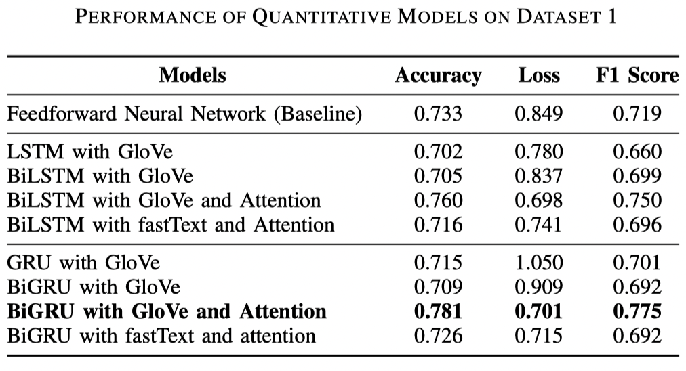
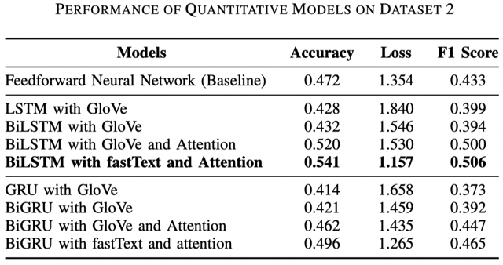
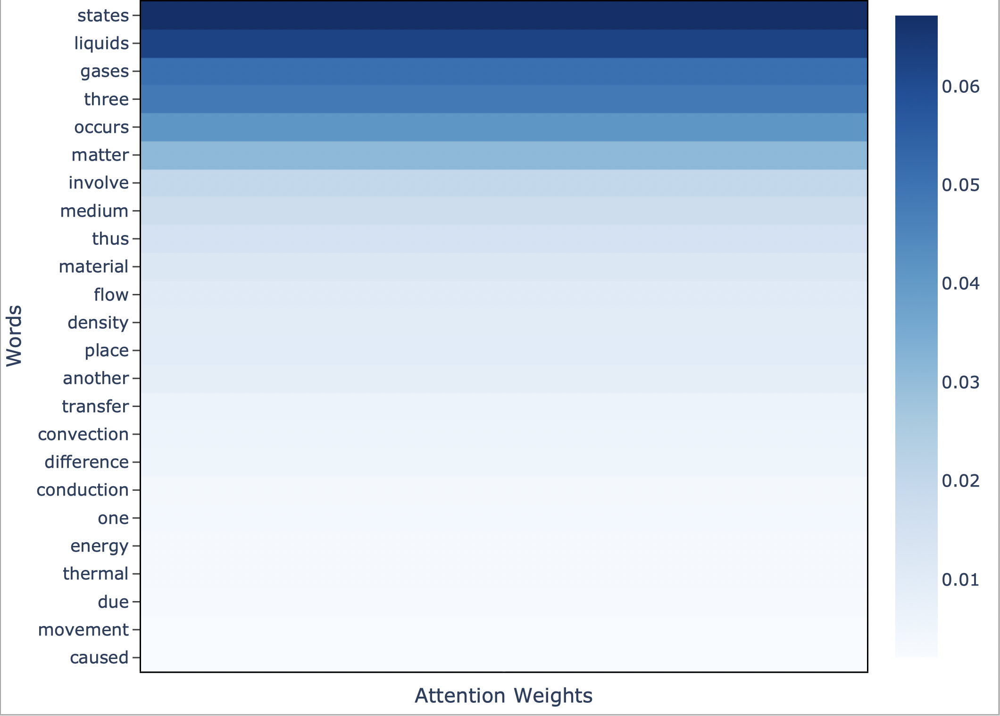

# Automatic Grading of Online Formative Assessments using Bidirectional Neural Networks and Attention Mechanism

> **Abstract:**  
> Formative assessments have been shown to be highly beneficial for students’ learning processes due to their ability to provide feedback to both teachers and students. However, the marking of short-answer questions in formative assessments is a tedious task for teachers. The advent of online learning platforms, however, has allowed for the digitalisation of student answers which opens up opportunities for automatic grading. We propose novel automatic grading architectures that (1) produce an accurate quantitative score in order to expedite the marking process and (2) provide qualitative feedback to teachers and students in terms of the key areas of improvement. These architectures consist of bidirectional long short-term memory and gated recurrent unit networks with an attention mechanism for quantitatively scoring answers, and a cosine similarity-based model that provides qualitative feedback based on a simple marking scheme comprising marking points. We evaluate these architectures across different metrics on two datasets collected from an online physics quiz, consisting of two short-answer physics questions on the topic of thermodynamics. We show that our architectures achieve reasonable accuracy on the scoring task and provide useful feedback to teachers and students, thus successfully aiding in automatically grading formative assessments.

## Overview
Source code and data for a paper on the automatic grading of online formative assessments which won the Best Paper Award at The 6th IRC Conference on Science, Engineering and Technology and Merit Award at Singapore Science and Engineering Fair 2020. The papers submitted, as well as a poster can be found [here](https://github.com/Xavilien/automatic-grading/tree/main/reports).

## Setup
Our code is written in `python` and we run our models on tensorflow. However, since it is currently being run on an Apple Silicon device, while you could run `pip install -r requirements.txt`, the installation for tensorflow will fail for non-Apple Silicon devices, for which you will probably have to run `pip install tensorflow` as well.

To run `processing.py`, you will also have to download some data from [NLTK](https://www.nltk.org/data.html) as well as the [GloVe](https://nlp.stanford.edu/projects/glove/) and [fastText](https://fasttext.cc/docs/en/english-vectors.html) word embeddings. A `setup.py` script has been created to download the necessary data. However, there is actually no real need to re-run `processing.py` as the arrays used in training have already been generated in `src/arrays`. This is beneficial as the GloVe and fastText embeddings are a total of 5.56GB large.

## Usage
1. Run processing.py to process the data (should be run only once)
2. Run train.py to train all the different types of models (5 times each)
3. Run evaluate.py to evaluate the models trained in 2.
4. Run split_test.py to train the two best models
5. Run attention.py to visualise the attention weights for a specific answer

### Pre-Processing the Data (Optional)
Run `processing.py` to clean and process the training dataset as well as the word embeddings. However, there is no real need to re-run this as the following arrays have already been generated in `src/arrays`:

- `answers.npy`: student answers that have been pre-processed to remove punctuation, non-alphabetical tokens and stop words
- `sequences`: `answers` but each word is represented by an integer based on `word_idx` 
- `scores.npy`: one-hot encoding of student scores 
- `word_idx.pickle`: dictionary that returns the id of a given word 
- `idx_word.pickle`: dictionary that returns the word given an id 
- `embedding_matrix_glove/fasttext/lda.npy`: embedding matrix for a particular word embedding, used for input into the embedding layer of neural network (lda has been generated only for question 1)

These arrays will be used subsequently in the training of the neural networks.

**Note**: refer to [here](#setup) for the additional data you will have to download if you would like to re-run `processing.py`. 

### Initialising Hyperparameters
`initialisation.py` is where we generate 36 sets of hyperparameters for all the models we want to train. The functions are called in `train.py` and `evaluate.py` and so there is no real need to run this, but you may want to examine the hyperparameters we search through.

### Generating Models
`models.py` contains the `get_model` function which generates a models given a set of hyperparameters. During training in `train.py`, we loop through all 36 sets of hyperparameters generated in `initialisation.py` and generate a model for each of them.

### Training Models
Running `train.py` will train 

### Evaluating All Models
**evaluate.py**: generate the results from the trained models

These are part of the results we got (when we froze the embeddings):

### Evaluating Model Performance Against Different Splits of Training and Test Set
**split_test.py**: compare the performance of the best models against number of training samples 

### Visualising the Attention Weights
Run `attention.py` to plot attention weights for a particular model given a sample answer (default is answer 113).

## Improvements
Some time has passed since this project was completed. Upon looking back, there are a few improvements I would have made if I were to redo the project.

Firstly, it would have been good to create a cross-validation set so that we have three sets in total: a training set, a validation set and a test set. This is because we are currently optimising the hyperparameters on the test set, which means that the results we put forth portray a biased estimate of how our models will do on unseen data.

Secondly, we would not have used early stopping and model checkpoints in our code in order to save the best performing model. Again, this method relies on the test set to pick the best model and so our results are biased because we are essentially optimising on the test set. Instead, other methods of addressing overfitting can be employed, including an increase in regularisation and creating more training data.

Thirdly, to address the choice of models, we understand that the current state-of-the-art models are mostly transformers instead of LSTMs. It would be interesting to train a transformer (or fine-tune an existing one) on this dataset to compare the performance.

### Some other minor code improvements:
- 